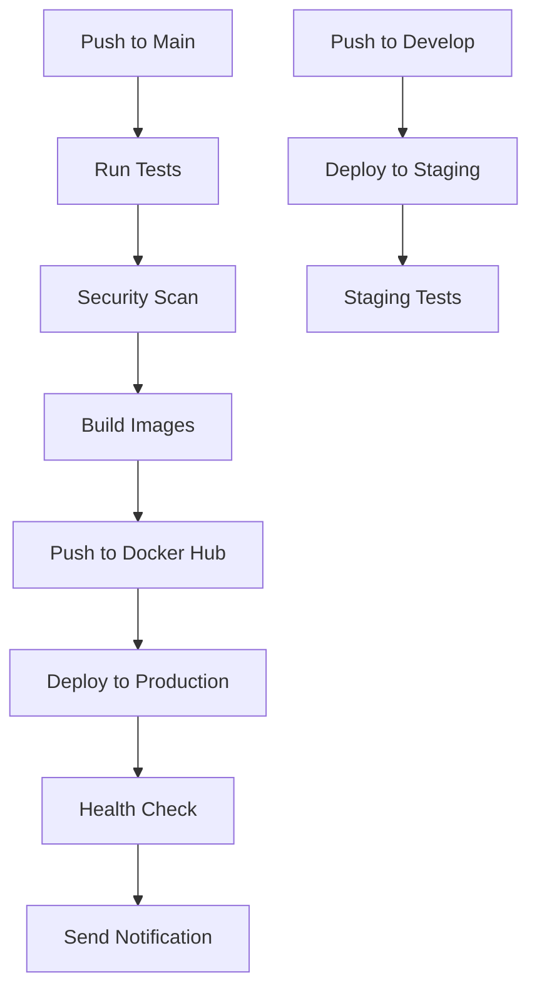

# 🚀 ThaiHand CI/CD Setup

คู่มือการตั้งค่าและใช้งาน Continuous Integration และ Continuous Deployment สำหรับโปรเจค ThaiHand

## 📋 สรุป

ระบบ CI/CD นี้ประกอบด้วย:

- **GitHub Actions** สำหรับ automation
- **Docker Hub** สำหรับ container registry
- **Digital Ocean** สำหรับ hosting
- **Slack** สำหรับ notifications
- **Automated testing, building, และ deployment**

## 🎯 Features

### ✅ Automated Pipeline
- **Test**: Unit tests, linting, security scanning
- **Build**: Docker image building และ pushing
- **Deploy**: Automatic deployment ไปยัง staging และ production
- **Monitor**: Health checks และ alerting

### ✅ Multi-Environment Support
- **Development**: Local development
- **Staging**: Testing environment
- **Production**: Live environment

### ✅ Security & Quality
- Vulnerability scanning
- Code quality checks
- Container security
- Automated backups

### ✅ Monitoring & Alerting
- System health monitoring
- Slack notifications
- Automated rollback
- Performance tracking

## 🚀 Quick Start

### 1. Prerequisites
```bash
# ตรวจสอบว่ามีไฟล์เหล่านี้
ls -la .github/workflows/
ls -la scripts/
ls -la docker-compose.prod.yml
```

### 2. Setup GitHub Secrets
ไปที่ `Settings → Secrets and variables → Actions` และเพิ่ม:

```bash
# Production
DEPLOY_HOST=your-server-ip
DEPLOY_USER=thaihand
DEPLOY_SSH_KEY=your-ssh-key
DOCKER_USERNAME=your-docker-username
DOCKER_PASSWORD=your-docker-password
SLACK_WEBHOOK=your-slack-webhook

# Staging (optional)
STAGING_HOST=your-staging-ip
STAGING_USER=thaihand
STAGING_SSH_KEY=your-staging-ssh-key
```

### 3. Setup Server
```bash
# บน Digital Ocean droplet
git clone https://github.com/your-username/thaihand.git /opt/thaihand
cd /opt/thaihand
sudo chmod +x scripts/setup-droplet.sh
sudo ./scripts/setup-droplet.sh
```

### 4. Configure Environment
```bash
cp env.production.example .env
nano .env  # แก้ไขค่าให้ถูกต้อง
```

### 5. Deploy
```bash
# Push ไปยัง main branch เพื่อ trigger deployment
git push origin main
```

## 📊 Workflow Overview



## 🔧 Configuration Files

### GitHub Actions Workflows
- `.github/workflows/deploy.yml` - Production deployment
- `.github/workflows/staging.yml` - Staging deployment  
- `.github/workflows/security.yml` - Security scanning

### Docker Configuration
- `docker-compose.prod.yml` - Production environment
- `env.production.example` - Environment template

### Scripts
- `scripts/deploy.sh` - Deployment automation
- `scripts/backup.sh` - Backup automation
- `scripts/monitor.sh` - Monitoring automation
- `scripts/setup-droplet.sh` - Server setup

## 🛠️ Usage

### Development Workflow
```bash
# 1. สร้าง feature branch
git checkout -b feature/new-feature

# 2. พัฒนาและ test
npm test
npm run lint

# 3. Commit และ push
git add .
git commit -m "Add new feature"
git push origin feature/new-feature

# 4. สร้าง Pull Request
# 5. Review และ merge
```

### Deployment Workflow
```bash
# Staging (develop branch)
git checkout develop
git merge feature/new-feature
git push origin develop
# → Automatic staging deployment

# Production (main branch)
git checkout main
git merge develop
git push origin main
# → Automatic production deployment
```

### Manual Operations
```bash
# ตรวจสอบ deployment status
sudo -u thaihand /opt/thaihand/scripts/deploy.sh status

# รัน backup
sudo -u thaihand /opt/thaihand/scripts/backup.sh backup

# ตรวจสอบ monitoring
sudo -u thaihand /opt/thaihand/scripts/monitor.sh status

# Rollback deployment
sudo -u thaihand /opt/thaihand/scripts/deploy.sh rollback
```

## 📈 Monitoring

### Health Checks
- **Application**: `https://thaihand.shop/health`
- **Frontend**: `https://thaihand.shop/api/health`
- **Backend**: `http://localhost:8000/health`

### System Monitoring
```bash
# ตรวจสอบ container status
docker ps

# ดู logs
docker-compose -f /opt/thaihand/docker-compose.prod.yml logs

# ตรวจสอบ system resources
htop
df -h
free -h
```

### Alerting
- **Slack**: Automatic notifications
- **Email**: System alerts
- **SMS**: Critical alerts (optional)

## 🔒 Security

### Automated Security Checks
- **Container Scanning**: Trivy vulnerability scanner
- **Code Security**: Bandit security linter
- **Dependency Scanning**: npm audit, safety
- **SSL Monitoring**: Certificate expiry checks

### Security Best Practices
- Environment variables สำหรับ secrets
- Non-root containers
- Minimal base images
- Regular security updates

## 📊 Backup Strategy

### Automated Backups
```bash
# Daily database backups
sudo -u thaihand /opt/thaihand/scripts/backup.sh backup

# Backup retention: 30 days
# S3 integration สำหรับ off-site storage
```

### Backup Types
- **Database**: PostgreSQL dumps
- **Volumes**: Docker volumes
- **Configuration**: Environment files
- **SSL Certificates**: Security certificates

## 🚨 Troubleshooting

### Common Issues

#### 1. Deployment Failures
```bash
# ตรวจสอบ deployment logs
sudo -u thaihand /opt/thaihand/scripts/deploy.sh status

# ดู container logs
docker-compose -f /opt/thaihand/docker-compose.prod.yml logs

# Rollback
sudo -u thaihand /opt/thaihand/scripts/deploy.sh rollback
```

#### 2. Health Check Failures
```bash
# ตรวจสอบ container status
docker ps

# ตรวจสอบ application health
curl -f http://localhost:8000/health
curl -f http://localhost:3000/api/health

# ตรวจสอบ database
docker-compose exec postgres pg_isready
```

#### 3. Monitoring Issues
```bash
# ตรวจสอบ monitoring logs
tail -f /var/log/thaihand-monitor.log

# รัน monitoring manually
sudo -u thaihand /opt/thaihand/scripts/monitor.sh monitor
```

### Debug Commands
```bash
# ตรวจสอบ GitHub Actions status
# ไปที่ GitHub repository → Actions tab

# ตรวจสอบ Docker images
docker images | grep thaihand

# ตรวจสอบ network connectivity
docker network ls
docker network inspect thaihand_thaihand-network
```

## 📝 Best Practices

### Code Quality
- ✅ เขียน tests สำหรับทุก feature
- ✅ ใช้ linting tools
- ✅ Review code ก่อน merge
- ✅ ใช้ conventional commits

### Security
- ✅ ใช้ environment variables
- ✅ ไม่ commit secrets
- ✅ รัน security scans อย่างสม่ำเสมอ
- ✅ อัพเดท dependencies

### Deployment
- ✅ Test ใน staging ก่อน production
- ✅ Monitor หลัง deployment
- ✅ มี rollback plan
- ✅ ใช้ blue-green deployment

### Monitoring
- ✅ ตั้งค่า alerting thresholds
- ✅ ตรวจสอบ logs อย่างสม่ำเสมอ
- ✅ มี incident response plan
- ✅ เก็บ metrics และ logs

## 🔄 Maintenance

### Regular Tasks
- **Daily**: ตรวจสอบ monitoring alerts
- **Weekly**: Review security scans
- **Monthly**: อัพเดท dependencies
- **Quarterly**: Review backup strategy

### Updates
- **Docker Images**: Automatic updates via CI/CD
- **System Packages**: Manual updates
- **SSL Certificates**: Automatic renewal
- **Backups**: Daily automated backups

## 📞 Support

### Documentation
- [CI/CD Setup Guide](cicd-setup.md)
- [Deployment Guide](deployment.md)
- [Monitoring Guide](monitoring.md)

### Contact
- **GitHub Issues**: สร้าง issue ใน repository
- **Slack**: #thaihand-devops channel
- **Email**: devops@thaihand.shop

### Emergency Contacts
- **System Admin**: admin@thaihand.shop
- **DevOps Team**: devops@thaihand.shop
- **On-call Engineer**: +66-xxx-xxx-xxxx

---

## 🎉 Success Metrics

### Deployment Metrics
- **Deployment Frequency**: Multiple times per day
- **Lead Time**: < 1 hour from commit to production
- **MTTR**: < 30 minutes for rollback
- **Success Rate**: > 99% successful deployments

### Quality Metrics
- **Test Coverage**: > 80%
- **Security Issues**: 0 critical vulnerabilities
- **Performance**: < 2s response time
- **Uptime**: > 99.9%

### Business Metrics
- **User Satisfaction**: > 4.5/5
- **Feature Delivery**: Weekly releases
- **Bug Resolution**: < 24 hours
- **Cost Optimization**: 20% reduction in infrastructure costs
